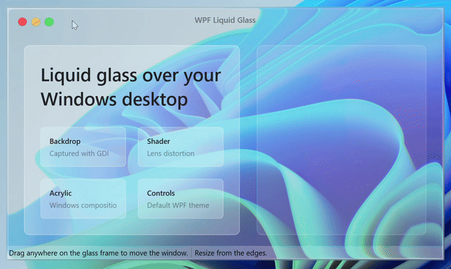
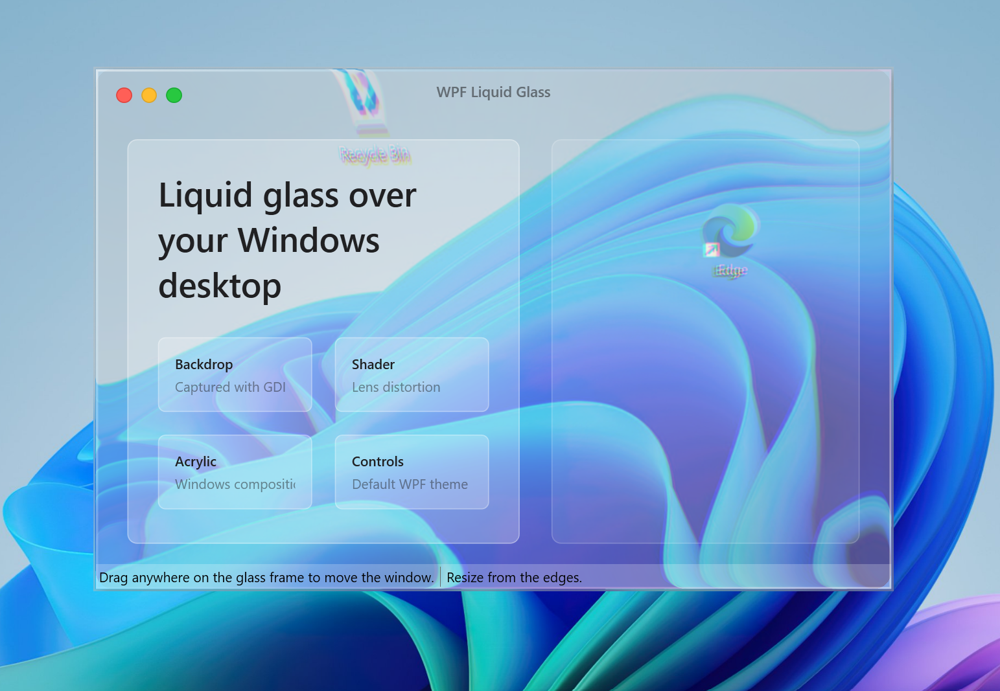

# wpf-liquid-glass-window

A small WPF sample that recreates an Apple Liquid Glass-inspired window surface on Windows.

<p align="center">
  
</p>

<p align="center">
  
</p>

[Watch the demo video](docs/Screen.mp4)

The demo is intentionally self-contained for a public blog repository. It pulls the idea from the `GlassyWindowStyle` in `XAMLTemplates.Net.WPF.Themes.Glass`, then copies only the pieces needed to explain the technique:

- a borderless transparent WPF window template;
- a desktop screenshot helper used as the shader input;
- a WPF `ShaderEffect` wrapper around `GlassyEffect.ps`;
- a lightweight demo window that leaves room to see the glass distortion clearly.

## How it works

`DemoApp/Themes/LiquidGlassWindow.xaml` defines `GlassyWindowStyle`.

The style creates three visual layers:

1. `WindowFrame`, whose background is replaced at runtime with a cropped screenshot of the desktop behind the window.
2. `GlassyLayer`, which applies `GlassyEffect` to distort that captured backdrop.
3. A light translucent content layer that lets the distortion remain visible.

`DemoApp/Behaviors/GlassyWindowBehavior.cs` keeps the cached desktop backdrop in sync when the window loads, moves, resizes, activates, or deactivates.

## Run

```powershell
dotnet run --project ".\DemoApp\DemoApp.csproj"
```

Build the whole solution with:

```powershell
dotnet build ".\02 WPF XAML Liquid Glass.slnx"
```

## Notes for the article

This sample is not using any Apple private APIs. It is a WPF/Win32 approximation that combines desktop capture and a pixel shader.

The shader approach was inspired by AmirHossein Aghajari's Medium article, "Liquid Glass: iOS Effect Explanation" published on November 24, 2025: https://medium.com/@aghajari/liquid-glass-ios-effect-explanation-dabadd6414ae

Apple and Liquid Glass are trademarks or design terms associated with Apple Inc. This repository is not affiliated with or endorsed by Apple.

## Structure

- `DemoApp/` - WPF demo application.
- `DemoApp/Themes/LiquidGlassWindow.xaml` - window template and glass resources.
- `DemoApp/Behaviors/GlassyWindowBehavior.cs` - screenshot capture and shader parameter updates.
- `DemoApp/Shaders/GlassyEffect.cs` and `DemoApp/Shaders/GlassyEffect.ps` - WPF shader wrapper and compiled pixel shader.
- `THIRD-PARTY-NOTICES.md` - attribution notes.

## License

MIT. See `LICENSE`.
